คุณสามารถอ่านรายละเอียดการทดสอบระบบเพิ่มเติมได้ที่ไฟล์ [INFORMATION.md](./INFORMATION.md)

## Quick Start Deployment
### 1. Local Development Setup

# Clone repository or Dowload file zip : https://github.com/aunlaphat/gold-trade-system
git clone https://github.com/aunlaphat/gold-trade-system.git
cd gold-trading-system

# Install dependencies
npm install
npm install -D tsx

# Setup environment variables
Create `.env` file for production (copy this your file or config):
`
# Database Configuration
MONGODB_URI=mongodb://localhost:27017
DB_NAME=gold_trading_system

# JWT Configuration (REQUIRED - must be at least 32 characters)
JWT_SECRET=your-super-secret-jwt-key-at-least-32-characters-long-change-this
JWT_EXPIRES_IN=1h
JWT_REFRESH_EXPIRES_IN=7d

# Server Configuration
PORT=5000
NODE_ENV=development
CLIENT_URL=http://localhost:3000
NEXT_PUBLIC_API_URL=http://localhost:5000 

# CORS Configuration (comma-separated list of allowed origins)
ALLOWED_ORIGINS=http://localhost:3000,http://localhost:5173

# Rate Limiting
RATE_LIMIT_WINDOW_MS=900000
RATE_LIMIT_MAX=100

# Logging
LOG_LEVEL=info

# Admin Account (for initial setup)
ADMIN_EMAIL=admin@example.com
ADMIN_USERNAME=admin
ADMIN_PASSWORD=adminpassword
`

# Initialize database
npm run setup-db

# How to import the sample data (optional):
1. Open MongoDB Compass
2. Select or create your database
3. Open the Collections tab
4. Select the target collection (or create a new one with the same name)
5. Click Import Data
6. Choose the corresponding JSON file from the data/ folder
7. Importing the test data is optional.
- You may skip this step if you prefer to start with an empty database.
🔑 Test Accounts (จาก data folder):
- login role admin ` email: admin@example.com ` ` pass: adminpassword `
- login role user ` email: 123@hotmail.com ` ` pass: 123456 `

# Start backend server (Terminal 1)
npm run server:dev

# Start frontend (Terminal 2)
npm run dev

Access the application:
- Frontend: http://localhost:3000
- Backend API: http://localhost:5000

---

## 🧪 การทดสอบ
### Unit Tests คุณสามารถอ่านรายละเอียดการทดสอบระบบเพิ่มเติมได้ที่ไฟล์ [TESTING.md](./TESTING.md)
ทดสอบ API ทุกตัวในระบบ `npm run test:api` 
ทดสอบ 4 เคสสำคัญตาม Requirement `npm run test:all` 

### Test Cases หลัก

1. **TC-001: Concurrent Access**
   - ทดสอบผู้ใช้หลายคนเข้าใช้งานพร้อมกัน

2. **TC-002: Transaction Stability**
   - ทดสอบ Transaction 100+ รายการพร้อมกัน

3. **TC-003: Price Status Control**
   - ทดสอบการควบคุมสถานะ (Online/Pause/Stop)

4. **TC-004: RealTime Display**
   - ทดสอบการแสดงราคาแบบเรียลไทม์

## 🔌 API Endpoints

### Authentication
- `POST /api/auth/register` - ลงทะเบียนผู้ใช้ใหม่
- `POST /api/auth/login` - เข้าสู่ระบบ

### Wallet
- `GET /api/wallet` - ดูข้อมูลกระเป๋าเงิน
- `POST /api/wallet/deposit` - ฝากเงิน
- `POST /api/wallet/withdraw` - ถอนเงิน
- `POST /api/wallet/exchange` - แลกเปลี่ยนสกุลเงิน

### Prices
- `GET /api/prices/current` - ดูราคาปัจจุบัน
- `GET /api/prices/history/:goldType` - ดูประวัติราคา

### Trading
- `POST /api/trading/execute` - ซื้อ/ขายทอง
- `GET /api/trading/history` - ดูประวัติการซื้อขาย
- `POST /api/trading/execute-bulk` - ซื้อขายแบบ bulk (สำหรับทดสอบ)

### Admin
- `GET /api/admin/status` - ดูสถานะทั้งหมด
- `PUT /api/admin/status/:goldType` - อัพเดทสถานะ

## 🔥 UI Preview

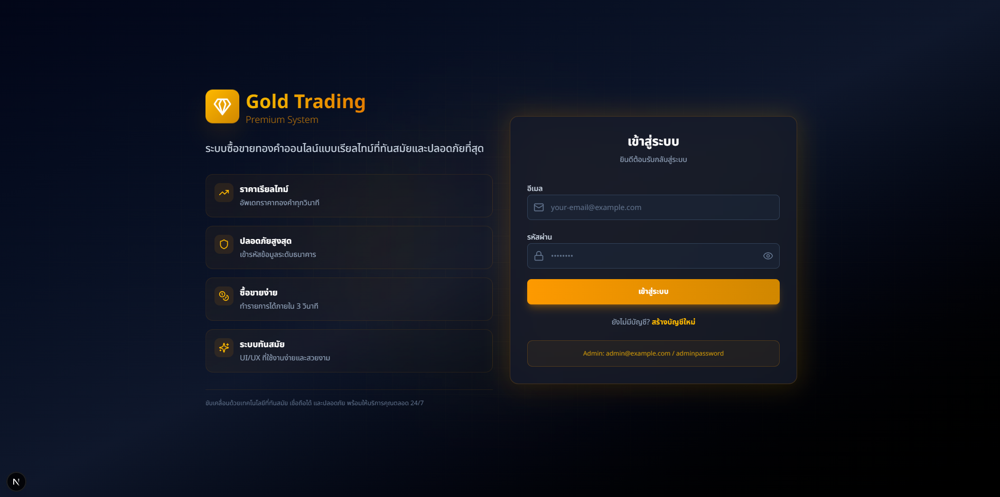

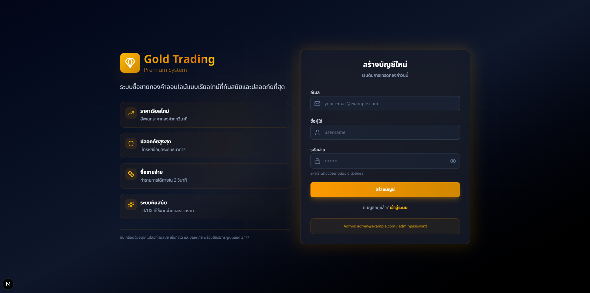

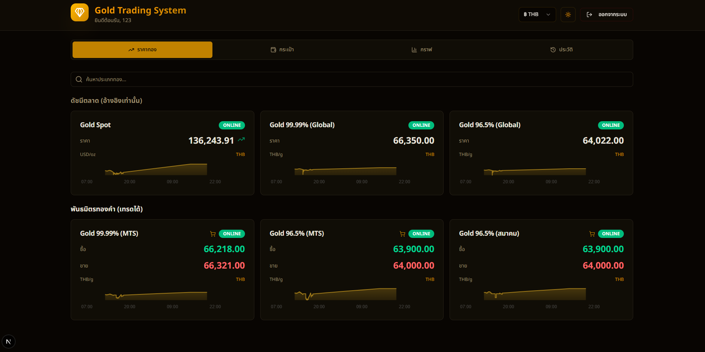

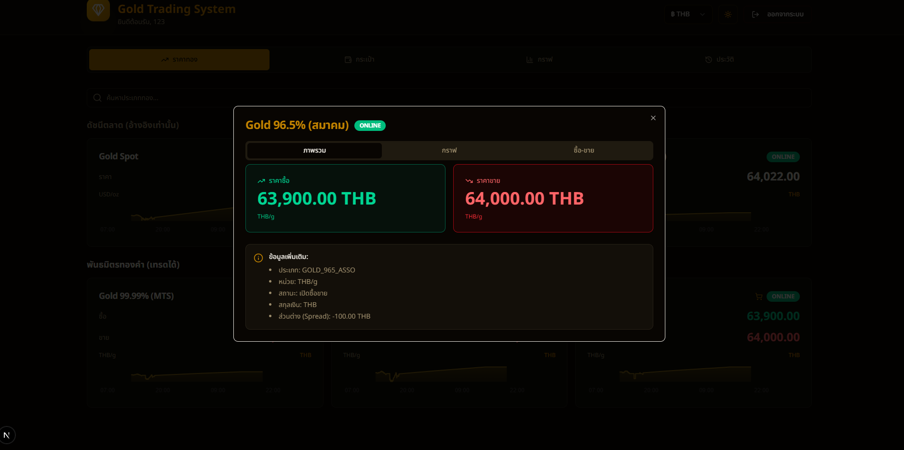

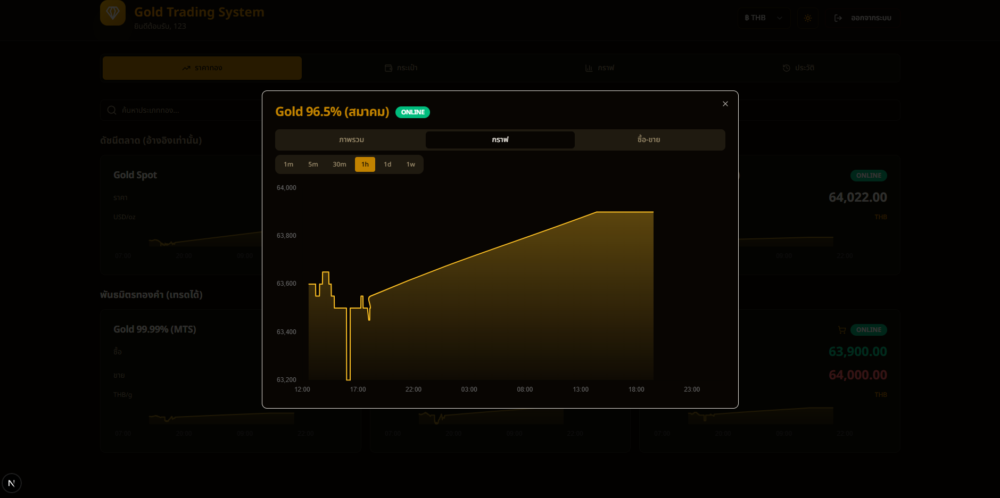

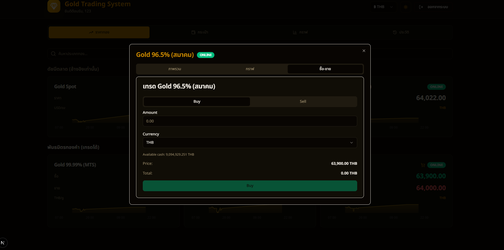

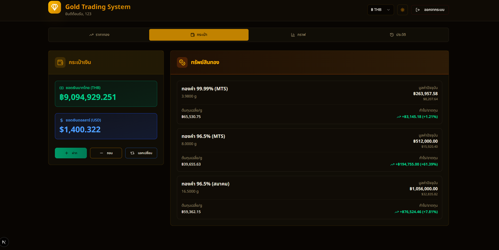

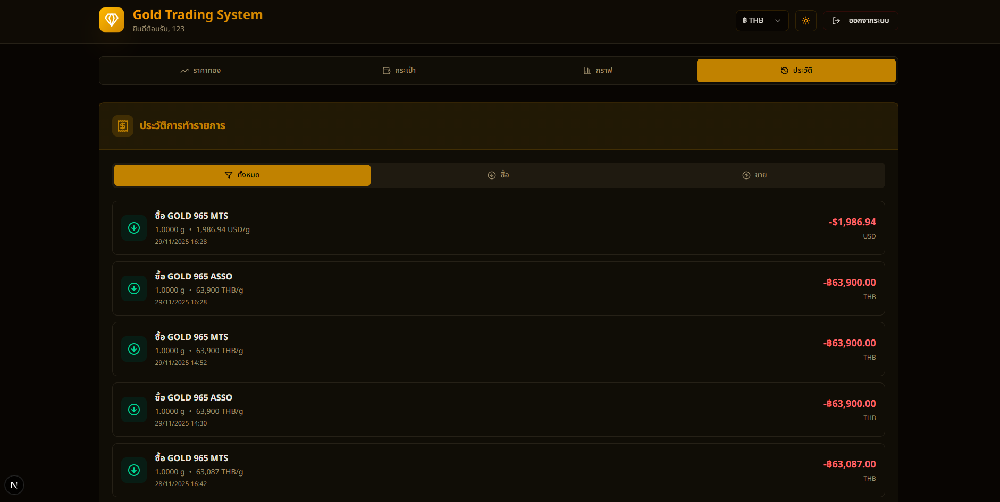

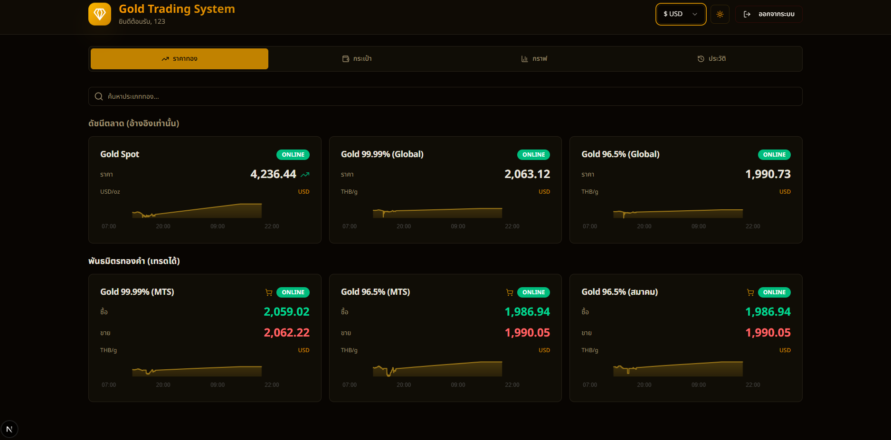

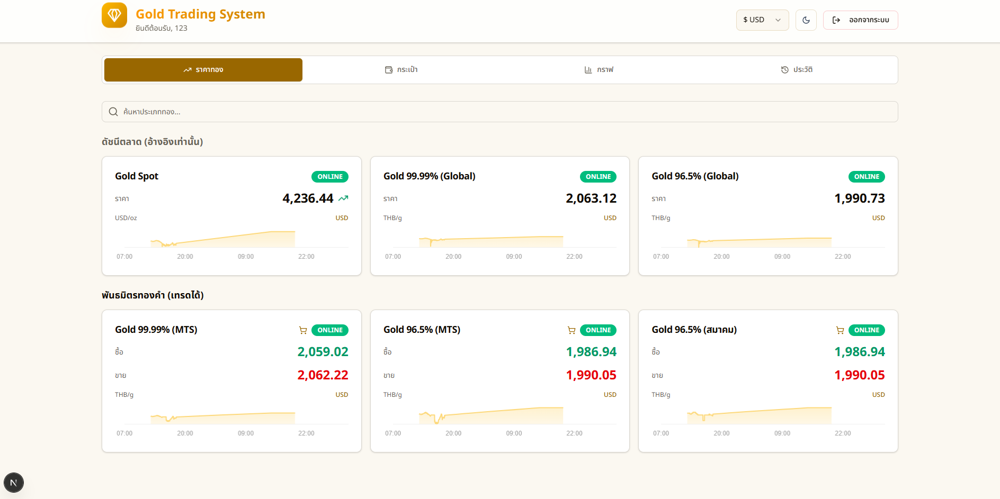

---

### 🟥 Admin Pages

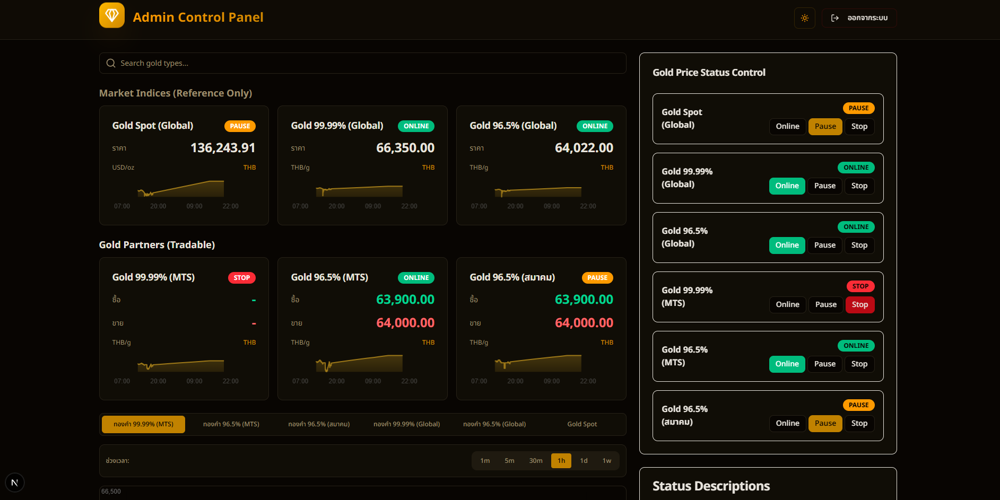

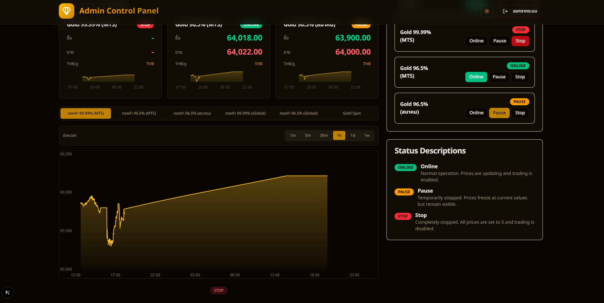
